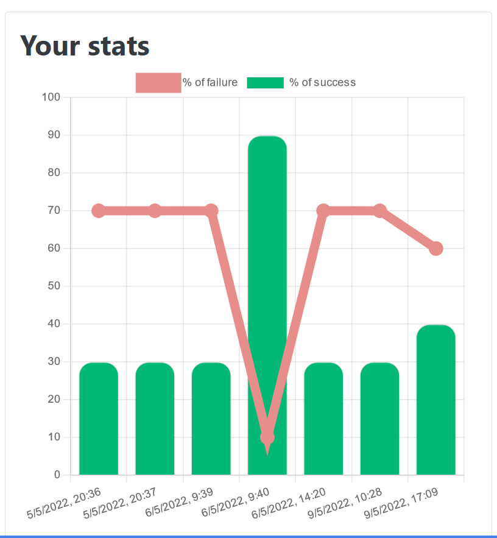

# boot109-spa
The Bridge - Exercise:

https://classroom.google.com/u/0/c/NDgwNDYwMTI2OTAz/a/NTExMTY0NjUzNDUz/details

## Description

### Authors
[Alex (@alextebbitt)](@alextebbitt) & [Xavi (@xavi-mat)](@xavi-mat)

### Technologies used
* HTML5 (only one file)
* [Bootstrap 5.1.3](https://getbootstrap.com)
* JavaScript (SPA)

### Challenge
Code a funcional quiz:
* With 10 questions
* Each question with 4 possible answers
* As a Single Page Application
* Fetching questions from an API
* Storing results in localStorage

## Screenshots

### Chart
A bar chart for the success percentage and a line chart for the failure percentage.

## TODO lists

### HTML, CSS
- [x] Structure of html minimal elements
- [x] Add navBar
- [x] Structure of html main containers
- [x] Add BS classes to elements
- [x] Beautify results
- [x] Spinner
- [x] Stats chart in home

### JS
- [x] Fetch data from API
- [x] Quiz functionality (questions, answers, next/back navigation)
- [x] Count right/wrong points
- [x] Show result points
- [x] Show result sentence (according to points)
- [x] Store points in localStorage
- [x] Retrieve points from localStorage
- [x] Show points in stats block
- [x] Progress bar
- [x] Toast
- [x] Spinner
- [x] Put data in chart
